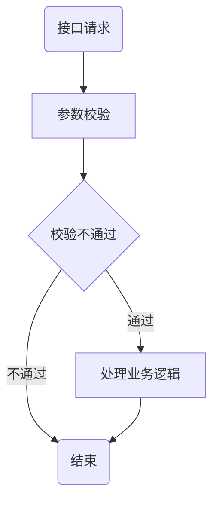
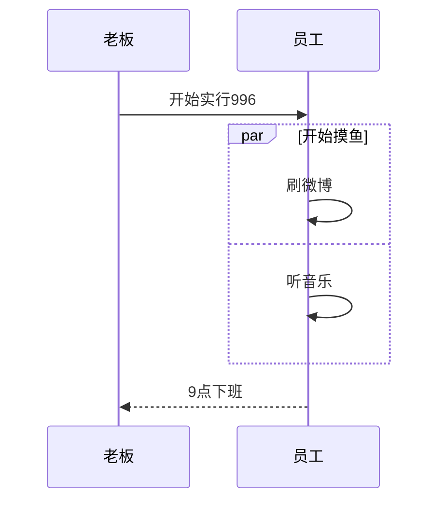

```mermaid
graph TB
    A(接口请求) --> B[参数校验]
    B[参数校验] --> C{校验通过?}
    C{校验通过?} -- 通过 --> d[处理业务逻辑]
    C{校验不通过} -- 不通过 --> e[结束]
    d[处理业务逻辑] --> e(结束)
```

```mermaid
sequenceDiagram
老板 ->> 员工 : 开始实行996
par 开始摸鱼
    员工 ->> 员工 : 刷微博
and
    员工 ->> 员工 : 听音乐
end

员工 -->> 老板 : 9点下班
```

